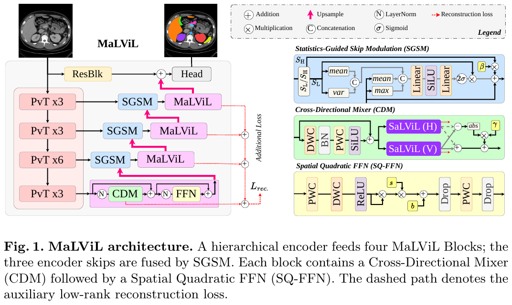
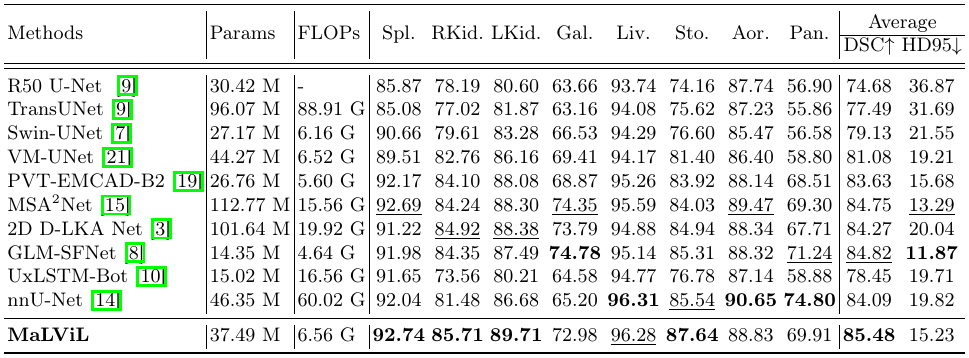
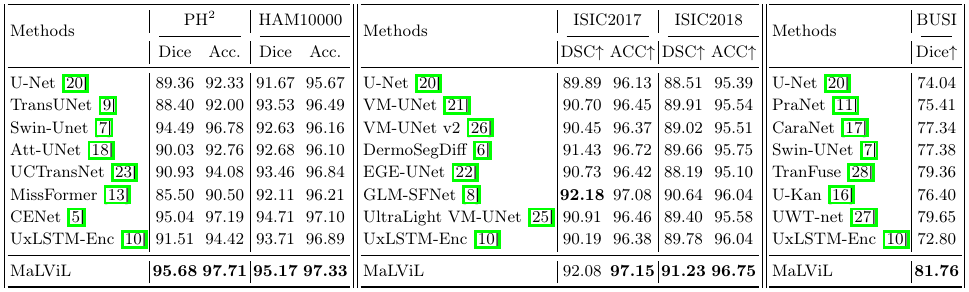

<h1 align="center">MaLViL: Multi-axis Low-rank Vision-LSTM for Medical Image Segmentation</h1>

<p align="center">
  <a href="https://arxiv.org/abs/2608.17635"></a>
  <a href="https://arxiv.org/abs/2608.17635"></a>
  <a href="https://github.com/xmindflow/MaLViL/releases"></a>
  <a href="LICENSE"></a>
</p>

<p align="center">MLMI Workshop, MICCAI 2026</p>

## Contents

- [Abstract](#abstract)
- [Setup](#setup)
- [Data](#data)
- [Train](#train)
- [Evaluate](#evaluate)
- [Pretrained weights](#pretrained-weights)
- [Results](#results)
- [Layout](#layout)
- [Citation](#citation)

## Abstract

Vision-LSTM (ViL) models long-range context well, but a full-sequence block costs O(<i>N</i><i>d</i><sup>2</sup>) and rasterization breaks neighbors across the scan axis. MaLViL keeps ViL in every decoder stage by running it on a compact rank-<i>p</i> subspace (Bi-LRViL), restoring cross-axis neighbors before flattening (SaLViL), mixing horizontal and vertical paths (CDM), and modulating encoder skips with a smooth / high-frequency split (SGSM). On skin-lesion, ultrasound, and multi-organ CT benchmarks it is competitive or state-of-the-art, while cutting ViL operator memory by up to 83× at fine decoder resolutions.

<p align="center">
  
</p>

## Setup

```bash
git clone https://github.com/xmindflow/MaLViL.git && cd MaLViL
python -m venv .venv && source .venv/bin/activate
pip install torch torchvision
pip install -r requirements.txt

export DATA_DIR=/path/to/datasets
export RESULTS_DIR=/path/to/results   # default: <repo>/results
```

Python 3.10 or newer. One 24 GB GPU is enough.

### Encoder

PVTv2-B2, initialized from ImageNet. The file is not redistributed here.

```bash
mkdir -p pretrained_pth/pvt
wget -O pretrained_pth/pvt/pvt_v2_b2.pth \
  https://github.com/whai362/PVT/releases/download/v2/pvt_v2_b2.pth
```

## Data

Six public benchmarks: **PH²**, **HAM10000**, **ISIC 2017**, **ISIC 2018**, **BUSI**, and **Synapse**. Download each from its source; the images are not included here. Skin and BUSI loaders cache an `np/` stack on the first run.

The paper splits are in [`splits/`](splits/README.md): one case ID per line. Those lists are what the reported numbers use, so keep them. Synapse reads `splits/synapse/` automatically. PH² rebuilds its cache from `splits/ph2/`. ISIC, HAM10000, and BUSI follow the same ID order (see `splits/README.md` for the counts).

| Dataset | Source | `$DATA_DIR` layout |
|---------|--------|--------------------|
| [ISIC 2017](https://challenge.isic-archive.com/data/#2017) | Training images + Part 1 GT | `Skin/ISIC2017/{ISIC-2017_Training_Data,ISIC-2017_Training_Part1_GroundTruth}/` |
| [ISIC 2018](https://challenge.isic-archive.com/data/#2018) | Task 1 training + GT | `Skin/ISIC2018/{ISIC2018_Task1-2_Training_Input,ISIC2018_Task1_Training_GroundTruth}/` |
| [PH²](https://www.fc.up.pt/addi/ph2%20database.html) | PH² database | `Skin/PH2/{trainx,trainy}/` |
| [HAM10000](https://doi.org/10.7910/DVN/DBW86T) | Images + lesion masks | `Skin/HAM10000/{images,masks}/` |
| [BUSI](https://www.kaggle.com/datasets/aryashah2k/breast-ultrasound-images-dataset) | Breast ultrasound | `US/busi/{images,masks}/` |
| [Synapse](https://github.com/Beckschen/TransUNet) | TransUNet `train_npz` + `test_vol_h5` | `Synapse/{train_npz,test_vol_h5}/` |

```
$DATA_DIR/Skin/ISIC2017/ISIC-2017_Training_Data/ISIC_0000000.jpg
$DATA_DIR/Skin/ISIC2017/ISIC-2017_Training_Part1_GroundTruth/ISIC_0000000_segmentation.png

$DATA_DIR/Skin/ISIC2018/ISIC2018_Task1-2_Training_Input/ISIC_0000000.jpg
$DATA_DIR/Skin/ISIC2018/ISIC2018_Task1_Training_GroundTruth/ISIC_0000000_segmentation.png

$DATA_DIR/Skin/HAM10000/images/ISIC_0024306.jpg
$DATA_DIR/Skin/HAM10000/masks/ISIC_0024306_segmentation.png

$DATA_DIR/Skin/PH2/trainx/IMD002.bmp
$DATA_DIR/Skin/PH2/trainy/IMD002_lesion.bmp

$DATA_DIR/US/busi/images/benign (1).png
$DATA_DIR/US/busi/masks/benign (1).png

$DATA_DIR/Synapse/train_npz/case0005_slice000.npz    # image [H,W], label [H,W]
$DATA_DIR/Synapse/test_vol_h5/case0001.npy.h5        # image [D,H,W], label [D,H,W]
```

ISIC 2017 uses the 2000 official training images (1250 / 150 / 600). Synapse follows the TransUNet lists in `splits/synapse/`; the loader reads them from the repo, or from `$DATA_DIR/Synapse/` if you copy them there. BUSI is grayscale (1 channel); the skin sets are RGB.

## Train

```bash
bash scripts/main.sh PH2 TRAIN
bash scripts/main.sh HAM10000 TRAIN
bash scripts/main.sh ISIC2017 TRAIN
bash scripts/main.sh ISIC2018 TRAIN
bash scripts/main.sh BUSI TRAIN
bash scripts/main.sh SYNAPSE TRAIN
```

Resume with `bash scripts/main.sh SYNAPSE TRAIN --resume`. Epochs, image size, loss, and the other defaults are at the top of `scripts/main.sh`.

`best.pth` is the checkpoint with the best validation Dice. On Synapse the 12 volumes are that validation set.

## Evaluate

```bash
EVAL_PT=weights/malvil-isic2018.pth bash scripts/main.sh ISIC2018 TEST
EVAL_PT=weights/malvil-synapse.pth  bash scripts/main.sh SYNAPSE TEST
```

`DATA_DIR` must point at the same layout as training. The ImageNet encoder file must be in place; the dataset checkpoint is loaded on top of it.

## Pretrained weights

One file per dataset is attached to the [GitHub release](https://github.com/xmindflow/MaLViL/releases) (`malvil-<dataset>.pth`, about 144 MB).

```bash
./scripts/fetch_weights.sh                 # all six
./scripts/fetch_weights.sh synapse         # one dataset
```

The script checks each file against the SHA256 in `scripts/fetch_weights.sh` and writes it under `weights/`.

## Results

**Table 1.** Evaluation results on the Synapse dataset (best results in bold; second-best results underlined).



**Table 2.** Comparison on PH², HAM10000, ISIC 2017, ISIC 2018, and BUSI.



## Layout

```
scripts/main.sh                 train or test one dataset
scripts/fetch_weights.sh        download the released checkpoints
src/main.py                     entry point
src/networks/malvil/net.py      MaLViL (Bi-LRViL, SaLViL, CDM, SGSM, SQ-FFN)
src/datasets/                   skin, BUSI, and Synapse loaders
splits/                         case-ID lists for the paper splits
assets/                         architecture figure and paper tables
pretrained_pth/pvt/             place pvt_v2_b2.pth here
requirements.txt
LICENSE
```

## Citation

```bibtex
@inproceedings{bozorgpour2026malvil,
  title     = {MaLViL: Multi-axis Low-rank Vision-LSTM for Medical Image Segmentation},
  author    = {Bozorgpour, Afshin and Ghorbani Kolahi, Sina and Heidari, Moein and Hacihaliloglu, Ilker and Merhof, Dorit},
  booktitle = {MICCAI Workshop on Machine Learning in Medical Imaging (MLMI)},
  year      = {2026},
  eprint    = {2608.17635},
  archivePrefix = {arXiv},
  primaryClass  = {cs.CV},
}
```

## License

MIT (see [`LICENSE`](LICENSE)). The datasets stay with their original providers. PVTv2-B2 ImageNet weights follow the PVT license and are not included here.
